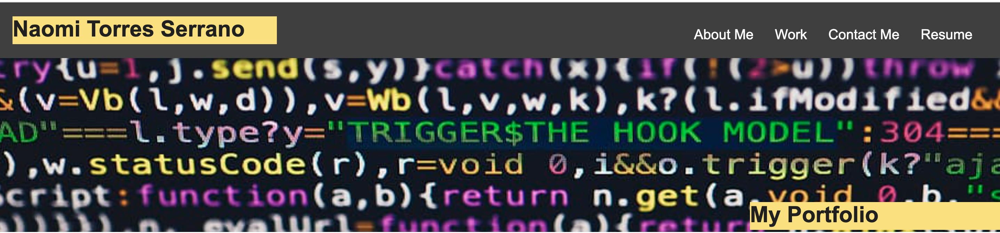
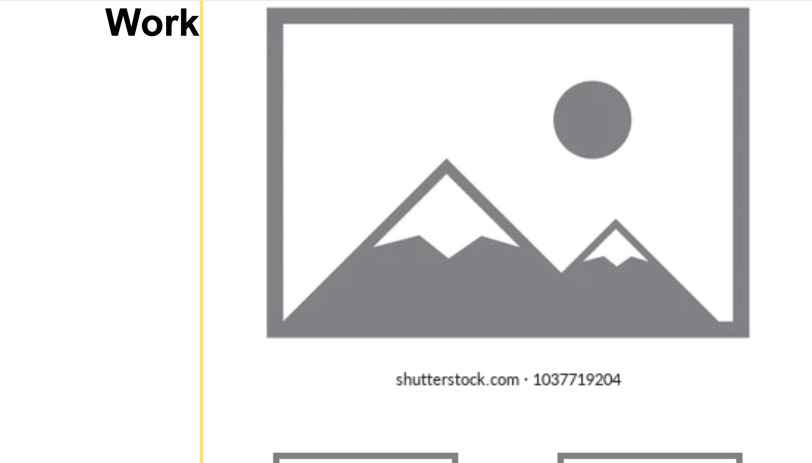

<h1>Profesional Portfolio <h1>

<h4>This page will show a brief description of me and my goals aswell as some pictures of my recent projects and multiple ways to contact me.</h4>
  

<h1>Menu Bar<h1>
<h4>The bar is located at the top of the website on the right side. It contains About me, Work, and Contact me which will take you to their corresponding sections. 

  

<h1>About me</h1>
<h4> The about me section is right bellow the the header. It hold a brief description of me. It can be accesed by clicking on the About me in the Menu Bar or by simply scrolling down until you see the About me section.</h4>

  

<h1>Work</h1>
<h4>The work section is right bellow the About me section. It holds my projects, although for now they are just place holder images. It can be accesed by clicking in the Menu where it says Work or by simply scrolling down.<h4> 

  

<h1>Contact Me</h1>
<h4>Lastly, we have the contact me section. It contains multiple places where to contact me. Once again, it can be accesed by cliking in the Menu where it says Contact Me or by simply scrolling down.<h4> 

  

<a href="https://naomi969.github.io/addvance-css-portfolio/"> Click here for deployed website<h4>